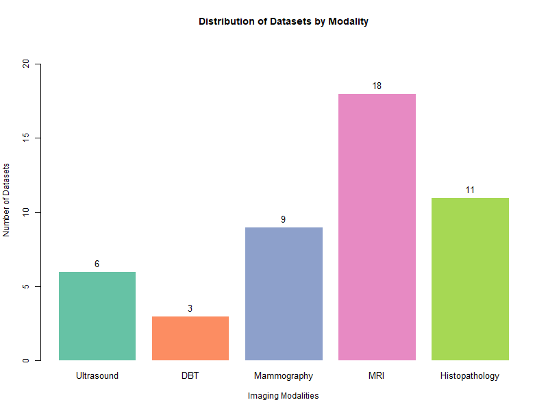
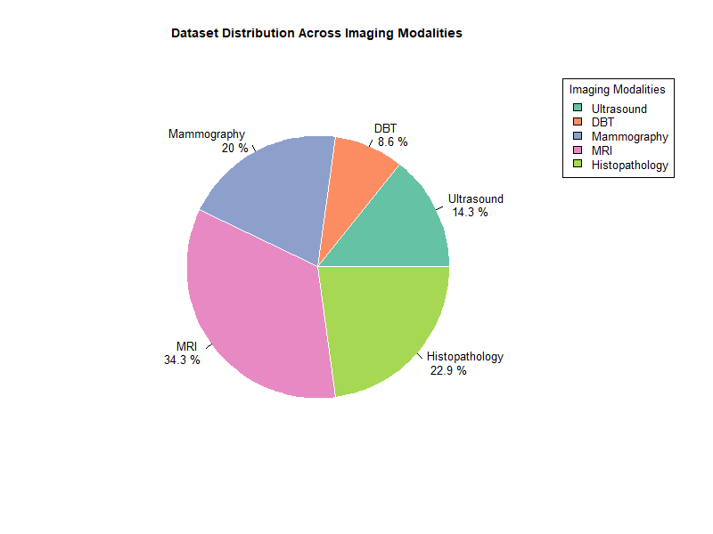

# Breast-Cancer-Imaging-Datasets
This repository serves as a centralized resource listing various breast imaging and pathology datasets commonly used in academic research, clinical training, and machine learning applications. The goal is to provide detailed summaries of key characteristics, usage instructions, and guidance on how to obtain these datasets, all in one place.
If you know any more datasets, and want to contribute, please submit a pull request and I'll happily approve it.

## Introduction

This repository provides a curated list of breast imaging and histopathology datasets, aiming to streamline access for researchers, clinicians, and students. Here, the datasets are separated by each modality for easier understanding. This repository is composed of 47 publicly available datasets.

Below is a histogram showing the number of datasets in each modality, and pie chart representations that visualize the distribution of datasets by modality.

**Histogram of Datasets by Modality:**

**Pie Chart of Datasets Distribution by Modality:**

## Table of Contents
- [Datasets](#datasets)
  - [Ultrasound](#ultrasound)
  - [Digital Breast Tomosynthesis (DBT)](#digital-breast-tomosynthesis-dbt)
  - [Mammography](#mammography)
  - [MRI](#mri)
  - [Histopathology](#histopathology)
- [Contributing & Contact](#contributing--contact)

## Datasets

### Ultrasound

| Dataset                                 | Subjects | Nº Images | Data Type | Format | Size   | Year | Cite | Download |
|------------------------------------------|----------|-----------|-----------|--------|--------|------|------|----------|
| Breast Ultrasound Images Dataset (BUSI)  | 600      | 780       | Classification, Segmentation         |  PNG      |  204 MB      |   2020   | [Dataset of breast ultrasound images](https://www.sciencedirect.com/science/article/pii/S2352340919312181 "Link to paper")  |   [Download here](https://www.kaggle.com/datasets/aryashah2k/breast-ultrasound-images-dataset_"Download_link")       |
| Breast-Lesions-USG                       |          |           |           |        |        |      |      |          |
| UDIAT Dataset                            |          |           |           |        |        |      |      |          |
| OASBUD Dataset                           |          |           |           |        |        |      |      |          |
| Ultrasound Breast Images for Breast Cancer |        |           |           |        |        |      |      |          |
| BUS Synthetic Dataset                    |          |           |           |        |        |      |      |          |

